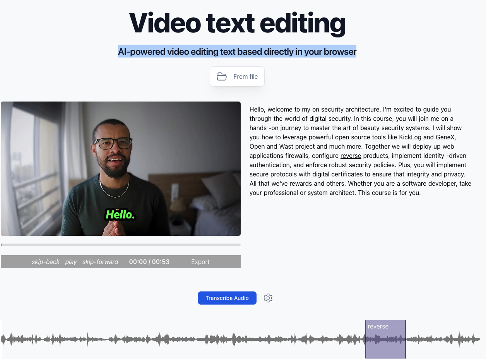

# Text based video editor
AI-powered video editing text based directly in your browser. 

This project is a web-based video editor that allows users to edit videos though the video transcription.
It leverages the power of AI to provide a seamless editing experience. 
[Try it out](https://apssouza22.github.io/video-text-edit/dist/)



## Running locally

1. Clone the repo and install dependencies:

    ```bash
    git clone https://github.com/apssouza22/video-edit.git
    cd video-text-edit
    npm install
    ```

2. Run the development server:

    ```bash
    npm run dev
    ```
    > Firefox users need to change the `dom.workers.modules.enabled` setting in `about:config` to `true` to enable Web Workers.
    > Check out [this issue](https://github.com/xenova/whisper-web/issues/8) for more details.

3. Open the link (e.g., [http://localhost:5173/](http://localhost:5173/)) in your browser.
